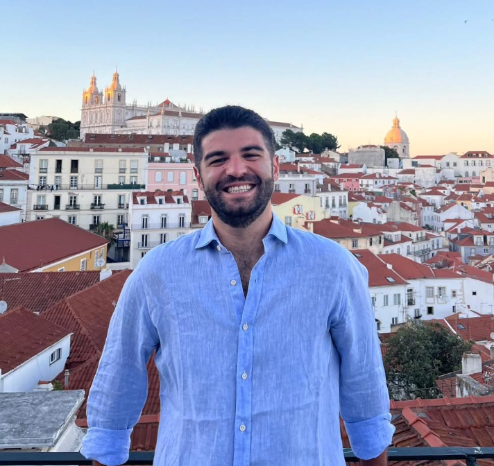

```{=html}
<link href="assets/js/aos/aos.css" rel="stylesheet">
<script src="assets/js/aos/aos.js"></script>
<script>
  document.addEventListener('DOMContentLoaded', function() {
    AOS.init();
        const curriculumLink = document.querySelector('.navbar a.nav-link[href$="CV_Marco_Vetrano.pdf"]');
        if (curriculumLink) {
            curriculumLink.setAttribute('href', 'assets/files/CV_MarcoVetrano_Eng.pdf');
        }
  });
</script>
```

::: {.grid}

::: {.g-col-12 .g-col-md-4}

::: {data-aos="fade-right"}
<center>

</center>

<br>

### Personal Data
**Marco Vetrano**
<br>
**Based in**: Palermo, Sicily, Italy

### Technology Stack

<div style="font-size: 0.85rem;">

<div class="d-flex flex-wrap gap-2">
  <span class="badge rounded-pill bg-primary" style="font-size: 1rem;">Python</span>
  <span class="badge rounded-pill bg-primary" style="font-size: 1rem;">Pytorch</span>
  <span class="badge rounded-pill bg-primary" style="font-size: 1rem;">Hugging Face</span>
  <span class="badge rounded-pill bg-primary" style="font-size: 1rem;">Docker</span>
  <span class="badge rounded-pill bg-primary" style="font-size: 1rem;">LaTeX</span>
  <span class="badge rounded-pill bg-primary" style="font-size: 1rem;">SQL</span>
  <span class="badge rounded-pill bg-primary" style="font-size: 1rem;">Quarto</span>
  <span class="badge rounded-pill bg-primary" style="font-size: 1rem;">Git</span>
  <span class="badge rounded-pill bg-primary" style="font-size: 1rem;">XGBoost</span>
  <span class="badge rounded-pill bg-primary" style="font-size: 1rem;">Linux</span>
  <span class="badge rounded-pill bg-primary" style="font-size: 1rem;">AWS</span>
  <span class="badge rounded-pill bg-primary" style="font-size: 1rem;">Agents Orchestration</span>
  <span class="badge rounded-pill bg-primary" style="font-size: 1rem;">PySpark</span>
  <span class="badge rounded-pill bg-primary" style="font-size: 1rem;">FastAPI</span>
  <span class="badge rounded-pill bg-primary" style="font-size: 1rem;">C++</span>
  <span class="badge rounded-pill bg-primary" style="font-size: 1rem;">Java</span>
  <span class="badge rounded-pill bg-primary  " style="font-size: 1rem;">Prompt Engineering</span>
</div>

</div>

### Specialization Area

<ul class="list-unstyled fw-medium">
    <li class="mb-2 d-flex align-items-center">
        <span class="p-1 rounded-circle bg-primary bg-opacity-25 me-2 d-flex align-items-center justify-content-center" style="width: 32px; height: 32px;">
            <i class="bi bi-radioactive text-primary"></i>
        </span>
        Physics
    </li>
    <li class="mb-2 d-flex align-items-center">
        <span class="p-1 rounded-circle bg-success bg-opacity-25 me-2 d-flex align-items-center justify-content-center" style="width: 32px; height: 32px;">
            <i class="bi bi-cpu-fill text-success"></i>
        </span>
        Machine Learning
    </li>
    <li class="mb-2 d-flex align-items-center">
        <span class="p-1 rounded-circle bg-danger bg-opacity-25 me-2 d-flex align-items-center justify-content-center" style="width: 32px; height: 32px;">
            <i class="bi bi-share-fill text-danger"></i>
        </span>
        Networks
    </li>
    <li class="mb-2 d-flex align-items-center">
        <span class="p-1 rounded-circle bg-info bg-opacity-25 me-2 d-flex align-items-center justify-content-center" style="width: 32px; height: 32px;">
            <i class="bi bi-bar-chart-line-fill text-info"></i>
        </span>
        Data Analysis
    </li>
</ul>

### Contacts

<a href="mailto:marco.vetrano01@gmail.com" title="Email"><i class="bi bi-envelope"></i> marco.vetrano01@gmail.com</a>
<br>
<a href="https://www.linkedin.com/in/marco-vetrano-1171a02ba/" target="_blank" title="LinkedIn"><i class="bi bi-linkedin"></i> Marco Vetrano</a>
<br>

:::

:::

::: {.g-col-12 .g-col-md-8}

::: {data-aos="fade-up"}

### About Me

**Computational Physicist** and **Data Scientist**. Specialized in developing scalable **Machine Learning** models for insight extraction. I design and implement **AI** solutions to solve complex analytical problems.

:::

::: {data-aos="fade-up"}

## Experience

**Research and Development in Quantum Machine Learning**

*04/2023 -- 03/2026 | University of Palermo*

*   Development of Classical-Quantum algorithms for data compression and extraction of physico-chemical properties from large astrophysical datasets. The codes were primarily developed in Python using NumPy, PyTorch, and Scikit-Learn for model implementation and pre-processing, and Matplotlib and Seaborn for visualization. Furthermore, the codes were deployed on Leonardo's proprietary HPC and IBM Quantum devices.
*   **Skills**: Python Programming, Machine Learning, Linux, Git.

**Research and Development in Quantum Machine Learning**

*02/2025 -- 08/2025 | IFISC - University of the Balearic Islands*

*   Implementation of classical and quantum machine learning models for chaotic time series prediction. Deployment of codes on IFISC's proprietary HPC.
*   **Skills**: Python Programming, Machine Learning, Linux, Git, Docker.

:::

::: {data-aos="fade-up"}

## Projects

**QuantumToolBox**

*2025 | University of Palermo*

*   Python package developed mainly with NumPy, scikit-learn, and Plotly for implementing quantum dynamics and building classification and time series prediction models.
*   Available on GitHub in the [**QuantumStuff**](https://github.com/MarcoVetrano01/QuantumStuff) repository.
*   **Stack**: NumPy, SciPy.sparse, Plotly, scikit-learn.

**AstroQELM**

*2025-2026 | University of Palermo*

*   Python package designed for end-to-end analysis of spectral data, with functions for reading and parsing h5 and txt files, preprocessing and compression with scikit-learn, and processing and classification with Qiskit, NumPy, and scikit-learn.
*   Available on GitHub in the [**AstroQELM**](https://github.com/MarcoVetrano01/AstroQELM) repository.
*   **Stack**: NumPy, h5py, pandas, Qiskit, scikit-learn, Matplotlib, Seaborn.

**Instagram-Analyzer**

*2026*

*   Backend app developed with FastAPI in Python for scraping Instagram profiles.
*   Extracts the latest reel and its comments using two Apify actors, then computes BPM and duration; it also includes Hugging Face models for speech-to-text transcription and sentiment analysis.
*   GitHub repository: [**instagram-analyzer**](https://github.com/MarcoVetrano01/instagram-analyzer)
*   **Stack**: FastAPI, Python, Apify, Hugging Face, Docker.

**Olist-App**

*2026*

*   Project for the end-to-end analysis of the Olist e-commerce dataset, with a pipeline for data download, database construction with SQLAlchemy, querying, aggregation, and cleaning in PostgreSQL.
*   Includes three sentiment analysis models of increasing complexity developed with scikit-learn, PyTorch, and Hugging Face.
*   Currently under development, with planned additions for a Streamlit GUI, a customer care agent, and a Tableau interface for aggregated data visualization.
*   GitHub repository: [**Olist-App**](https://github.com/MarcoVetrano01/Olist-App)
*   **Stack**: Docker, SQLAlchemy, PostgreSQL, scikit-learn, PyTorch, Hugging Face, Streamlit, Tableau.

**CopyWriter AI Agent**

*2026*

*   An AI agent created with LangGraph and LangChain. The agent is set up to write SEO articles, perform keyword research via SerpAPI, and use them to write 600-word economic-financial articles, generating a title and sections. The article is then used to generate metadata and converted into HTML format for publishing as a draft on WordPress via REST API.
*   GitHub repository: [**CopyWriter AI Agent**](https://github.com/MarcoVetrano01/CopyWriter-AI-Agent)
*   **Stack**: Python, LangChain, LangGraph, REST API.

:::

::: {data-aos="fade-up"}

## Education

*   **2023 - 2026** - **Ph.D. in Physics**, University of Palermo
    *   Ph.D. research carried out at the University of Palermo, with a 6-month period abroad at IFISC. Scholarship funded by PNRR Funds on the STILES project.
*   **05/2026 - Present** - **Master in AI Development and Engineering**, ProfessionAI
    *   Dual master's degree offered by ProfessionAI with final attainment of a certification with European validity. The master lasts two years and aims to train in the development of AI solutions using custom models, with mixed Python and C++ programming; it provides instruction in Computer Vision, Explainable AI, and Reinforcement Learning.
*   **2026** - **Machine Learning and Data Science in Python; Deep Learning and Neural Networks in Python**, Udemy by ProfessionAI
*   **2026** - **SQL with Oracle, SQL Server and MySQL**, Udemy
*   **2020 - 2023** - **Master's Degree in Physics**, University of Palermo
    *   Master's Degree in Physics specializing in Theoretical Information Physics and Quantum Machine Learning.
*   **2016 - 2019** - **Bachelor's Degree in Physical Sciences**, University of Palermo

:::

::: {data-aos="fade-up"}

## Publications

*   **2025** - "State estimation with quantum extreme learning machines beyond the scrambling time.", *Springer Nature npj Quantum Information* 11.1 (2025): 20.
*   **2025** - "Exoplanetary atmospheres retrieval via a quantum extreme learning machine.", *arXiv preprint arXiv:2509.03617*.

:::

::: {data-aos="fade-up"}

## Certificates

*   **2026** - Udemy Certification: Machine Learning and Data Science in Python
*   **2023** - Duolingo C1 Certification in English

:::

::: {data-aos="fade-up"}

## Languages

| Language | Level | Details |
|---|---|---|
| Italian | C2 | Native Speaker |
| English | C1 | Writing: C1, Reading: C1, Listening: C1, Speaking: C1 |

:::

::: {data-aos="fade-up"}

## Other Experience

**Academic Tutor (STEM)**

*2022 and 2024 | University of Palermo*

*   Teaching support for Physics, Mathematical Analysis, and Geometry courses.
*   Personalized mentoring for students with learning disabilities (DSA).

**Data Analyst Intern**

*2022 | Ri.MED Foundation*

*   Application of Network Analysis techniques for the study of RNA structures, identifying critical interaction patterns.

**Data Analyst Intern**

*2018 | IASF - Institute for Space Astrophysics and Cosmic Physics*

*   Development of C scripts for the processing and spectral analysis of data from black holes.

:::

::: {data-aos="fade-up"}

## Awards

*   **2023** - First place at **QuHack4AI: Quantum Hackathon for Industrial Applications**, organized by the University of Bologna and Unipol with a project on variational algorithms for the study of hydrogen and water molecules.
*   **2023** - **"Eduardo Gugino" Award** for the Master's thesis on "Information Scrambling in Quantum Extreme Learning Machines".

:::

::: {data-aos="fade-up"}

## Talks

*   **2023** - "Information Scrambling in Quantum Extreme Learning Machines for State Estimation" @ New Trends in Non-equilibrium Statistical Mechanics 2nd Course
*   **2024** - "QELM response to scrambling dynamics and applications to atmospheric retrieval" @ International School on Non-Equilibrium Phenomena - Quantum Reservoir Computing Working Party
*   **2025** - "Exoplanetary Retrieval with Quantum Extreme Learning Machines" @ National Congress of the Italian Physical Society (SIF)

:::

:::

:::
